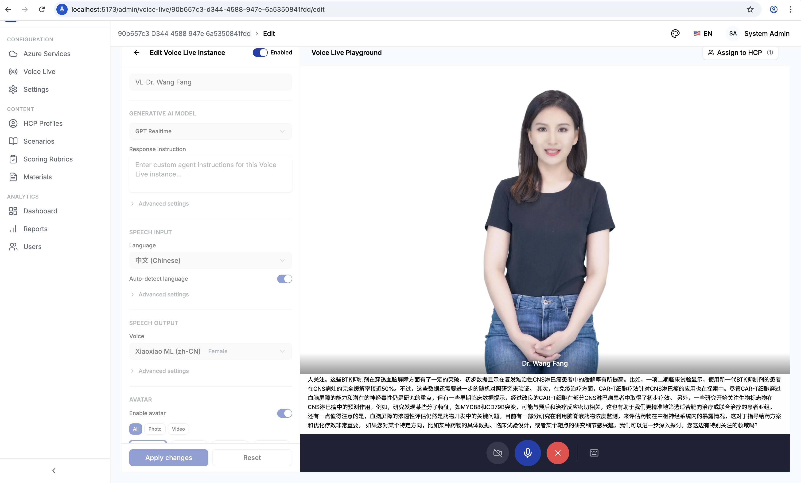
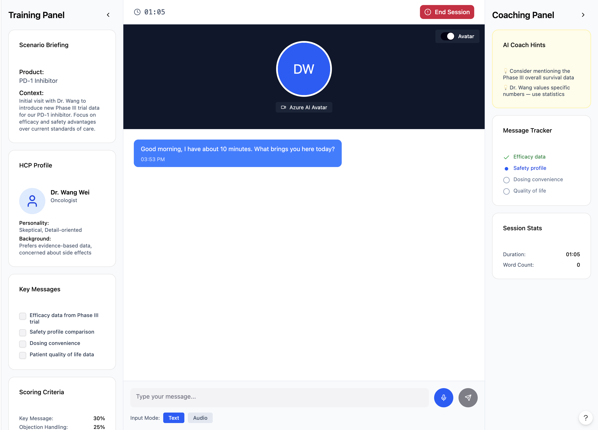
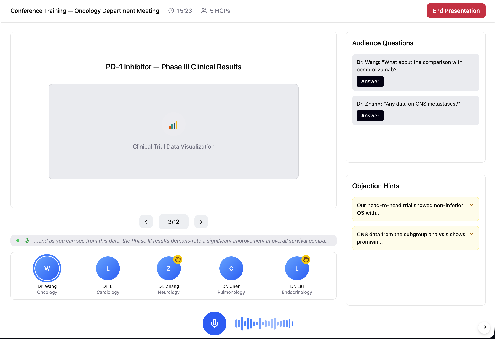
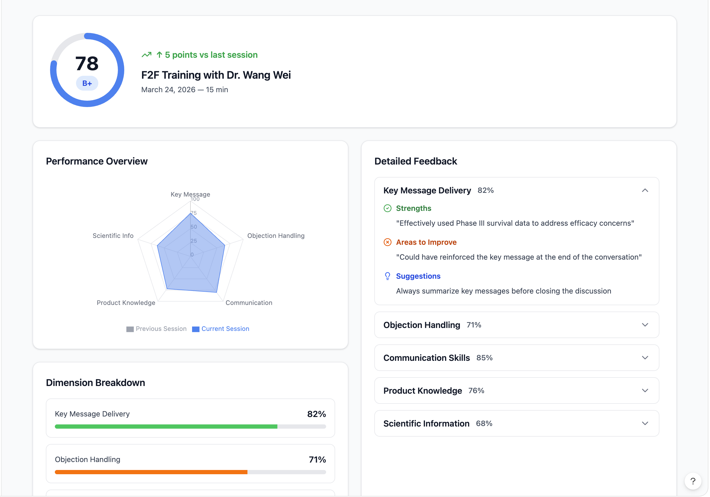
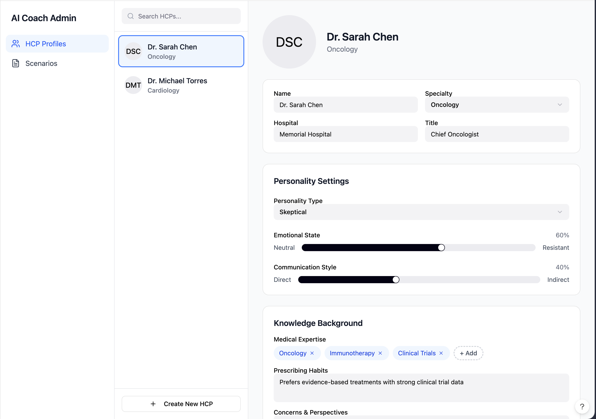
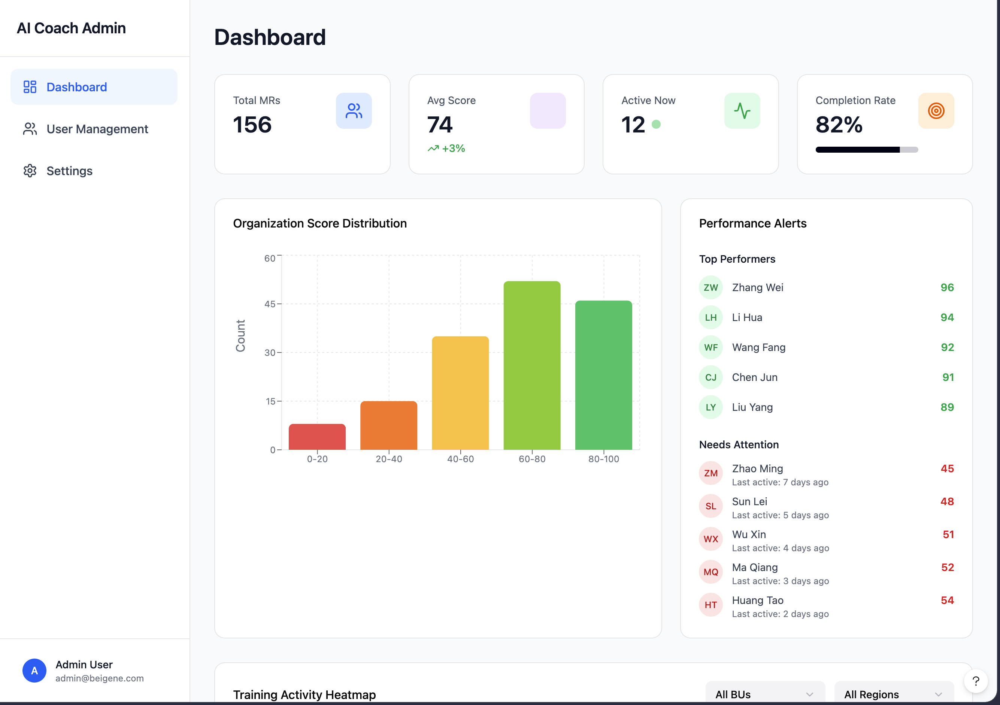
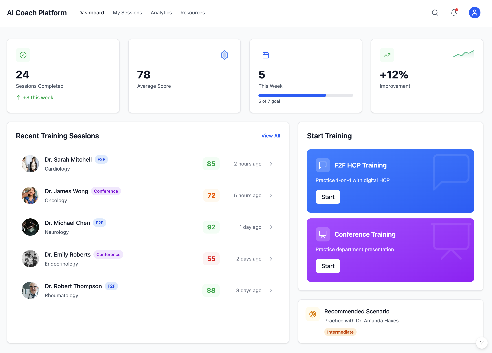

# AI Coach Platform

<p align="center">
  <strong>AI-Powered Medical Representative Training Platform</strong><br/>
  <em>面向医药代表的 AI 智能教练平台 — BeiGene (百济神州)</em>
</p>

<p align="center">
  
  
  
  
  
  
</p>

---

## What is AI Coach?

AI Coach 是一个基于 **Azure AI Services** 的医药代表（MR）智能培训平台。平台通过 **实时语音对话 + 数字人形象 (Avatar)** 模拟真实的 HCP（Healthcare Professional，医疗专业人员）互动场景，帮助 MR 在安全的练习环境中提升沟通技巧和产品知识。

**核心价值**：MR 可以随时随地与 AI 驱动的数字化 HCP 进行逼真的对话练习，并获得即时的、多维度的反馈，无需真实 HCP 或培训师在场。

---

## Highlight: Voice Live + Digital Human Agent / 亮点：实时语音 + 数字人 Agent

<p align="center">
  
</p>

> **与 AI 数字医生面对面实时对话** — 这是平台最核心的旗舰功能

平台集成 **Azure Voice Live API** 和 **Azure AI Avatar**，实现了业界领先的数字人实时语音交互体验：

- **Voice Live Playground** — 完整的实时语音配置与测试工作台
- **数字人形象 (Avatar)** — 栩栩如生的 3D 虚拟医生形象，支持面部表情和口型同步
- **GPT Realtime 模型** — 基于 GPT-4o Realtime 的超低延迟对话，自然流畅如真人
- **VAD 自动检测** — 语音活动检测 (Voice Activity Detection)，无需手动按键，说完即回应
- **多语言支持** — 中文/英文自动检测，语音输入语言自适应
- **语音定制** — 可选择不同声线和语言的 TTS 语音角色
- **HCP Agent 绑定** — 每个 Voice Live 实例可绑定到特定 HCP Agent，继承其角色设定和知识背景
- **WebSocket 全双工** — 后端 Python SDK 代理，前端通过 WebSocket 实现实时双向音频流

```
┌──────────────┐     WebSocket      ┌──────────────┐    Voice Live API    ┌──────────────────┐
│   Browser    │◄──────────────────►│   Backend    │◄───────────────────►│  Azure AI        │
│  (React +    │   Audio Stream     │  (FastAPI +  │   GPT Realtime      │  Foundry         │
│   Avatar)    │   + Transcript     │  Python SDK) │   + STT/TTS/VAD     │  Voice Live      │
└──────────────┘                    └──────────────┘                     └──────────────────┘
       │                                                                        │
       │  WebRTC (ICE/SDP)                                                      │
       └───────────────────────────────► Azure AI Avatar (Digital Human) ◄──────┘
```

---

## Key Features / 核心功能

### 7 种 MR-HCP 交互模式

平台支持 **7 种核心通信模式**，全面覆盖医药代表的培训需求：

| # | 模式 | 描述 | 技术基础 |
|---|------|------|----------|
| 1 | **Text Chat** 文本对话 | 与数字化 HCP 进行文字实时对话 | Azure OpenAI GPT-4o |
| 2 | **Voice Chat** 语音对话 | 语音输入，AI 语音回复（ASR + TTS） | Azure Speech Services |
| 3 | **Voice Live** 实时语音 | 低延迟实时语音交互，VAD 自动检测 | Azure Voice Live API (WebSocket) |
| 4 | **Avatar Chat** 数字人对话 | 带虚拟形象的语音互动 | Azure AI Avatar + Speech |
| 5 | **Voice Live + Avatar** 实时语音+数字人 | 实时语音交互配合数字人形象 | Voice Live + Avatar 联动 |
| 6 | **Conference Text** 学术会议(文本) | 模拟科室学术会议，多 HCP 参与 | Multi-Agent Orchestration |
| 7 | **Conference Voice** 学术会议(语音) | 语音驱动的学术会议模拟 | Speech + Multi-Agent |

### Voice Live 实例管理

- **实例生命周期** — 创建、配置、启用/禁用 Voice Live 实例
- **模型选择** — 支持 GPT Realtime 等实时对话模型
- **Response Instructions** — 自定义 Agent 响应指令
- **语音输入配置** — 语言选择、自动语言检测、高级 ASR 参数
- **语音输出配置** — TTS 声线选择、语速、音调调节
- **Avatar 配置** — 启用/禁用数字人、照片/视频形象切换
- **HCP Agent 分配** — 将实例绑定到特定 HCP 角色，继承 Agent 属性

### F2F 一对一 HCP 拜访训练

<p align="center">
  
</p>

- 模拟真实的医药代表-医生面谈场景
- 支持文字/语音/实时语音/数字人多种交互方式
- 场景背景及 HCP 角色信息可见
- 异议处理训练和关键信息传递练习
- 历史对话回放与复盘

### 虚拟科室学术会议

<p align="center">
  
</p>

- 一对多模式：面对多位虚拟 HCP 进行学术演讲
- 虚拟听众根据角色性格提出不同问题
- 实时语音转写显示
- 自动生成典型异议场景

### 多维度评分与反馈

<p align="center">
  
</p>

- **关键信息传递** — 产品核心卖点是否清晰传达
- **异议处理** — 应对 HCP 质疑的能力
- **沟通技巧** — 对话流畅度、倾听能力、共情表达
- **产品知识** — 对药品信息的准确掌握
- **科学信息** — 临床数据引用的准确性
- 实时建议 + 训练后详细报告

### 数字化 HCP 角色配置

<p align="center">
  
</p>

- 可配置的虚拟 HCP 角色：姓名、专科、性格特征
- 知识背景和医学观点自定义
- 不同的情绪状态和沟通风格
- 与 Azure AI Foundry Agent 深度集成
- 支持多产品/多疾病领域的训练场景

### 数据看板与报告

<p align="center">
  
</p>

- 个人维度：训练进度、评分趋势、能力雷达图
- 团队维度：部门排名、完成率统计
- 按 BU / 职级 / 时间段筛选
- 支持 PDF / Excel 格式导出

---

## Architecture / 系统架构

```
┌─────────────────────────────────────────────────────────────────┐
│                        Frontend (React SPA)                      │
│  React 18 + TypeScript + Vite 6 + Tailwind CSS v4               │
│  TanStack Query v5 | React Router v7 | Axios                    │
└────────────────────────┬────────────────────────────────────────┘
                         │ REST API / WebSocket
┌────────────────────────┴────────────────────────────────────────┐
│                     Backend (FastAPI ASGI)                        │
│  Python 3.11+ | SQLAlchemy 2.0 (async) | Alembic | JWT Auth      │
│                                                                   │
│  ┌──────────────────────────────────────────────────────────┐    │
│  │              AI Coaching Service Layer                     │    │
│  │                                                           │    │
│  │  ┌─────────┐ ┌──────────┐ ┌──────────┐ ┌─────────────┐  │    │
│  │  │  Text    │ │  Voice   │ │  Avatar  │ │ Voice Live  │  │    │
│  │  │  Chat    │ │  Chat    │ │  Chat    │ │ (WebSocket) │  │    │
│  │  └─────────┘ └──────────┘ └──────────┘ └─────────────┘  │    │
│  │  ┌─────────────────┐  ┌──────────────────────────────┐   │    │
│  │  │  Conference      │  │  Multi-Agent Orchestration   │   │    │
│  │  │  (Text + Voice)  │  │  (HCP Agent Registry)        │   │    │
│  │  └─────────────────┘  └──────────────────────────────┘   │    │
│  └──────────────────────────────────────────────────────────┘    │
└────────────────────────┬────────────────────────────────────────┘
                         │
┌────────────────────────┴────────────────────────────────────────┐
│                      Azure AI Services                            │
│                                                                   │
│  ┌──────────────┐  ┌──────────────┐  ┌────────────────────────┐  │
│  │ Azure OpenAI │  │ Azure Speech │  │  Azure AI Avatar       │  │
│  │ GPT-4o       │  │ ASR + TTS    │  │  Digital Human         │  │
│  └──────────────┘  └──────────────┘  └────────────────────────┘  │
│  ┌──────────────┐  ┌──────────────┐  ┌────────────────────────┐  │
│  │ AI Foundry   │  │ Voice Live   │  │  Content Understanding │  │
│  │ Agent        │  │ Real-time    │  │  (Document Processing) │  │
│  └──────────────┘  └──────────────┘  └────────────────────────┘  │
└──────────────────────────────────────────────────────────────────┘
                         │
                    PostgreSQL (prod) / SQLite (dev)
```

---

## Tech Stack / 技术栈

| 层级 | 技术 | 用途 |
|------|------|------|
| **Frontend** | React 18, TypeScript (strict), Vite 6, Tailwind CSS v4 | 单页应用 (SPA) |
| **Backend** | Python 3.11+, FastAPI, SQLAlchemy 2.0 (async), Alembic | API 服务 |
| **AI Engine** | Azure OpenAI (GPT-4o), Anthropic Claude, OpenAI | 对话引擎 |
| **Voice** | Azure Speech Services (ASR/TTS), Voice Live API | 语音交互 |
| **Avatar** | Azure AI Avatar | 数字人形象 |
| **Agent** | Azure AI Foundry (AI Projects SDK) | HCP Agent 编排 |
| **Database** | PostgreSQL (prod), SQLite + aiosqlite (dev) | 数据存储 |
| **State Mgmt** | TanStack Query v5 (server state), React Context | 前端状态 |
| **Testing** | pytest + pytest-asyncio, Playwright (E2E) | 测试 |
| **Infra** | Docker, Azure Container Apps, GitHub Actions CI/CD | 部署 |
| **i18n** | 中英文双语支持，架构可扩展至欧洲多语言 | 国际化 |

---

## Screenshots / 界面预览

<table>
  <tr>
    <td align="center" colspan="2"><strong>Voice Live + 数字人 Playground</strong><br/></td>
  </tr>
  <tr>
    <td align="center"><strong>MR 工作台</strong><br/></td>
    <td align="center"><strong>F2F HCP 训练</strong><br/></td>
  </tr>
  <tr>
    <td align="center"><strong>学术会议模式</strong><br/></td>
    <td align="center"><strong>评分与反馈</strong><br/></td>
  </tr>
  <tr>
    <td align="center"><strong>HCP 角色配置</strong><br/></td>
    <td align="center"><strong>管理员看板</strong><br/></td>
  </tr>
</table>

---

## Live Demo

| 服务 | URL |
|------|-----|
| Frontend | https://ai-coach-frontend.mangoforest-104bd67e.eastasia.azurecontainerapps.io |
| Backend API | https://ai-coach-backend.mangoforest-104bd67e.eastasia.azurecontainerapps.io |
| API Docs (Swagger) | https://ai-coach-backend.mangoforest-104bd67e.eastasia.azurecontainerapps.io/docs |

> 每次 push 到 `main` 分支后通过 GitHub Actions 自动部署到 Azure Container Apps。

---

## Quick Start / 快速开始

### Prerequisites

- Python 3.11+, Node.js 20+, Docker (optional)

### Local Development

```bash
# Clone
git clone https://github.com/huqianghui/AI-Coach-vibe-coding.git
cd AI-Coach-vibe-coding

# Backend
cd backend
python3 -m venv .venv && source .venv/bin/activate
pip install -e ".[dev]"
cp .env.example .env          # 配置 Azure AI 服务密钥
python3 scripts/init_db.py
python3 scripts/seed_data.py
uvicorn app.main:app --reload --port 8000

# Frontend (new terminal)
cd frontend
npm ci
npm run dev
# → http://localhost:5173
```

### Docker

```bash
docker-compose up
# Backend:  http://localhost:8000
# Frontend: http://localhost:5173
```

### Default Credentials

| 角色 | 用户名 | 密码 |
|------|--------|------|
| 管理员 | admin@aicoach.com | admin123 |
| 医药代表 | mr@aicoach.com | test123 |

---

## API Endpoints

启动后端后访问 Swagger UI: http://localhost:8000/docs

| 模块 | 路径前缀 | 功能描述 |
|------|----------|----------|
| Auth | `/api/v1/auth` | JWT 登录、用户信息、Token 刷新 |
| HCP Profiles | `/api/v1/hcp-profiles` | 虚拟 HCP 角色配置 CRUD |
| Scenarios | `/api/v1/scenarios` | 训练场景管理 |
| Sessions | `/api/v1/sessions` | 训练会话生命周期管理 |
| Coaching | `/api/v1/coaching` | AI 对话交互（Text/Voice） |
| Scoring | `/api/v1/scoring` | 多维度评分与反馈 |
| Voice | `/api/v1/voice` | 语音服务（ASR/TTS/Voice Live） |
| Avatar | `/api/v1/avatar` | 数字人服务配置 |
| Config | `/api/v1/config` | 系统配置管理 |
| Azure Config | `/api/v1/azure-config` | Azure AI 服务连接配置 |
| Materials | `/api/v1/materials` | 培训材料管理 |
| Reports | `/api/v1/reports` | 报告导出 |
| Voice Live | `/api/v1/voice-live` | Voice Live 实例管理与 Playground |

---

## Project Structure

```
AI-Coach-vibe-coding/
├── backend/
│   ├── app/
│   │   ├── api/              # FastAPI routers (13 modules)
│   │   ├── models/           # SQLAlchemy ORM (10 models)
│   │   ├── schemas/          # Pydantic v2 request/response schemas
│   │   ├── services/         # Business logic + AI adapters
│   │   │   └── agents/       # AI coaching adapter framework
│   │   │       └── adapters/ # Claude, Azure OpenAI, GPT-4, Mock
│   │   └── utils/            # Exceptions, pagination
│   ├── tests/                # 78+ test cases
│   └── alembic/              # Database migrations
├── frontend/
│   ├── src/
│   │   ├── pages/            # 41 route-level pages (admin + user)
│   │   ├── components/       # 100+ React components
│   │   │   ├── shared/       # Reusable UI components
│   │   │   ├── coach/        # AI coaching components
│   │   │   ├── voice/        # Voice & Avatar components
│   │   │   ├── conference/   # Conference mode components
│   │   │   ├── scoring/      # Scoring & feedback
│   │   │   └── analytics/    # Dashboard & charts
│   │   ├── hooks/            # TanStack Query hooks
│   │   └── api/              # Typed axios client
│   └── e2e/                  # 31 Playwright E2E tests
├── docs/                     # Requirements, specs, plans
├── wiki/                     # Auto-synced to GitHub Wiki
├── .github/workflows/        # CI/CD pipelines
└── CLAUDE.md                 # Engineering handbook
```

---

## Development Roadmap / 开发路线

v1.0 里程碑已完成全部 12 个阶段（62/62 计划执行完毕）：

| 阶段 | 名称 | 关键交付 |
|------|------|----------|
| 01 | Foundation, Auth & Design System | JWT 认证、设计系统、基础框架 |
| 01.1 | UI Figma Alignment | Figma 设计稿 1:1 还原 |
| 02 | F2F Text Coaching | 文本对话 AI 教练核心功能 |
| 03 | Scoring & Assessment | 多维度评分系统 |
| 04 | Dashboard & Reporting | 数据看板与报告 |
| 05 | Training Materials | 培训材料管理 |
| 06 | Conference Module | 虚拟学术会议功能 |
| 07 | Azure Service Integration | 7 种 Azure AI 模式集成 |
| 08 | Voice & Avatar Demo | 语音/数字人交互演示 |
| 09 | Integration Testing | 真实 Azure 服务集成测试 |
| 10 | UI Polish | 专业化 UI 统一优化 |
| 11 | HCP Agent Integration | HCP Agent 自动同步 AI Foundry |

**进行中**: Phase 12-14 — Voice Live 实例管理、Playground、HCP Agent 重构

---

## CI/CD Pipeline

```
Push/PR → Backend Test → Frontend Test → E2E Test → Deploy (main only)
              │               │              │            │
          Ruff lint       TypeScript      Playwright   Azure Container
          pytest          Vite build      Chromium     Apps (ACR)
```

---

## Documentation

| 文档 | 描述 |
|------|------|
| [CLAUDE.md](CLAUDE.md) | 工程手册 — 编码标准、架构约定、注意事项 |
| [Wiki](../../wiki) | 架构文档、开发者入门、项目路线图 |
| [Requirements](docs/requirements.md) | 业务需求规格说明 |
| [Requirements (中文)](docs/requirements-cn.md) | 业务需求（中文版） |
| [Solution Design](docs/capgemini-ai-coach-solution.md) | 解决方案设计文档 |
| [Best Practices](docs/best-practices.md) | 工程模式参考 |

---

## Contributing

请参考 [CLAUDE.md](CLAUDE.md) 中的编码标准和 Pre-Commit Checklist。

```bash
# Backend checks
cd backend && ruff check . && ruff format --check . && pytest -v

# Frontend checks
cd frontend && npx tsc -b && npm run build
```

---

## License

Private — BeiGene Internal Use
