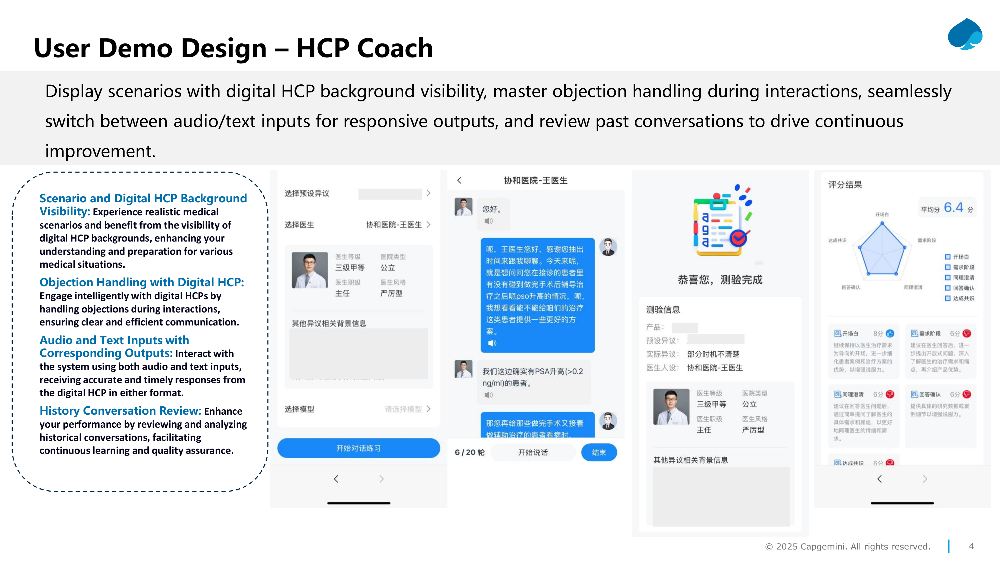
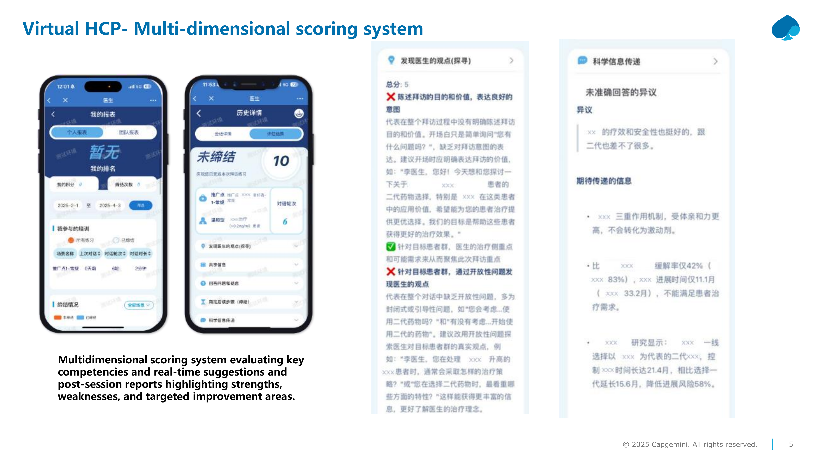
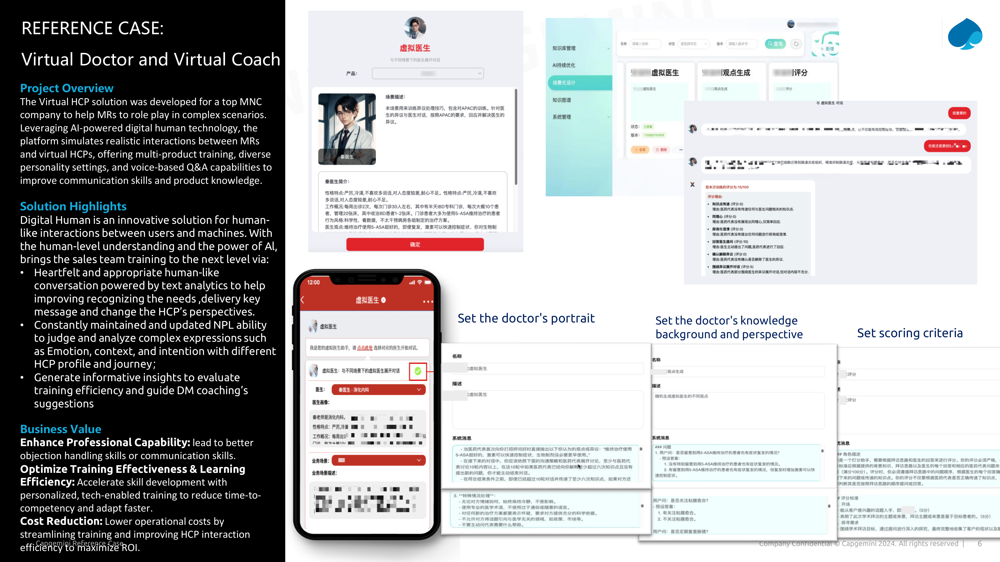
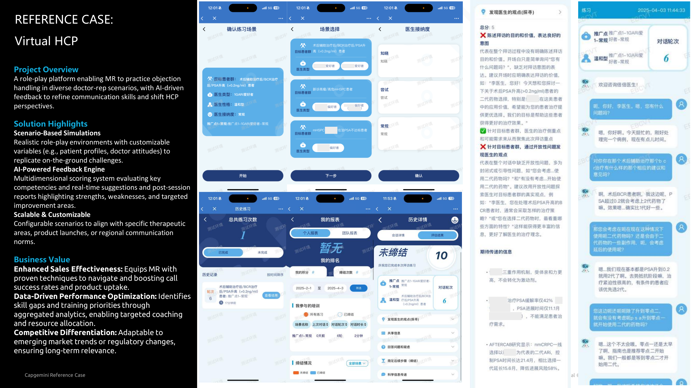

# Capgemini AI Coach Solution

> An introduction to Capgemini AI Coach — AI-Powered Training for Medical Representatives (MR)

---

## 1. Solution Overview

### AI-Powered Training for MR — Virtual F2F HCP Engagement & Department Conference Presentation

Our AI-powered Digital HCPs simulate real-world interactions with:

- **Human-like emotional depth** for objection handling drills & virtual department conference presentation
- **Personalized training paths** based on MR's role/BU (Business Unit)
- **Data-driven insights** to turn practice into measurable growth
- **Dynamic course optimization** leveraging AI capability

### Core Competencies Elevated

- Communication and situational response
- Medical presentation skills

### Two Primary Interaction Modes

| Mode | Description |
|------|-------------|
| **One-on-one F2F Call** | Direct communication with a Digital HCP |
| **One-to-many Conference Presentation** | Virtual Department Conference Presentation with Digital HCP audience |

### Technology Pipeline

```
Greetings → Delivery Key Msg → F2F Call → Conference Presentation → Objection Handling
                                    ↓
                                   NLP
                           Voice Processing (ASR)
                                    ↓
              ┌─────────────────────┼─────────────────────┐
              ↓                     ↓                     ↓
      Product Knowledge    Customized Training    Interaction Question
                                    ↓
                         Performance Evaluation
                                    ↓
                          Report & Dashboard
```

### Business Value

| Value | Description |
|-------|-------------|
| **Accelerate Training Efficiency** | Cut time-to-competency |
| **Significant Cost Optimization** | Reduce L&D OPEX |
| **Fully Traceable Training Paths** | Audit-ready competency tracking |

---

## 2. Core Business Scenarios

> *Digitalization empowers efficient training*

### 2.1 Training Material Management

- Centralized document management for Word/Excel/PDF/content uploads
- Version control and archiving of training materials
- Automatic deletion of voice records per retention policies
- Historical data archiving for departed employees

### 2.2 F2F HCP Engagement

- Handle F2F calls with objection handling
- Provide scenario and digital HCP background visibility for MR
- Accept audio and text inputs with corresponding outputs from Digital HCP
- Allow history conversation review
- Provide scores and feedback based on score criteria
- Offer a customizable rating criteria and feedback system

### 2.3 Virtual Department Conference Presentation

- Support content presentations with product/disease knowledge and audience question answering
- Provide presentation multi-scenario visibility for MR
- Accept audio input with live translated text on screen
- Generate typical objections based on historical data and provide verbal suggestions
- Offer a customizable rating criteria and feedback

### 2.4 Report and Dashboard

- Generates standard reports with sorting/filtering by BU, role, and time period
- Provides personal and group-level analysis of training results
- Enables export of results in PDF/Excel formats
- Tracks training progress/completion status across organization

---

## 3. User Demo Design — HCP Coach

> Display scenarios with digital HCP background visibility, master objection handling during interactions, seamlessly switch between audio/text inputs for responsive outputs, and review past conversations to drive continuous improvement.

### Key UI Features



#### 3.1 Scenario and Digital HCP Background Visibility
Experience realistic medical scenarios and benefit from the visibility of digital HCP backgrounds, enhancing your understanding and preparation for various medical situations.

#### 3.2 Objection Handling with Digital HCP
Engage intelligently with digital HCPs by handling objections during interactions, ensuring clear and efficient communication.

#### 3.3 Audio and Text Inputs with Corresponding Outputs
Interact with the system using both audio and text inputs, receiving accurate and timely responses from the digital HCP in either format.

#### 3.4 History Conversation Review
Enhance your performance by reviewing and analyzing historical conversations, facilitating continuous learning and quality assurance.

---

## 4. Virtual HCP — Multi-dimensional Scoring System



Multidimensional scoring system evaluating key competencies with:

- **Real-time suggestions** during training sessions
- **Post-session reports** highlighting:
  - Strengths
  - Weaknesses
  - Targeted improvement areas

### Scoring Dimensions

The scoring system includes evaluation across:
- Delivery of key messages
- Objection handling effectiveness
- Communication skills
- Product knowledge accuracy
- Scientific information delivery

---

## 5. Reference Case: Virtual Doctor and Virtual Coach



### Project Overview
The Virtual HCP solution was developed for a top MNC company to help MRs role-play in complex scenarios. Leveraging AI-powered digital human technology, the platform simulates realistic interactions between MRs and virtual HCPs, offering multi-product training, diverse personality settings, and voice-based Q&A capabilities to improve communication skills and product knowledge.

### Solution Highlights

Digital Human is an innovative solution for human-like interactions between users and machines. With the human-level understanding and the power of AI, brings the sales team training to the next level via:

- **Heartfelt and appropriate human-like conversation** powered by text analytics to help improve recognizing the needs, delivery of key messages, and changing the HCP's perspectives
- **Constantly maintained and updated NLP ability** to judge and analyze complex expressions such as Emotion, Context, and Intention with different HCP profiles and journeys
- **Generate informative insights** to evaluate training efficiency and guide DM coaching's suggestions

### Configuration Features

| Feature | Description |
|---------|-------------|
| **Set the doctor's portrait** | Customize the virtual HCP's visual appearance |
| **Set the doctor's knowledge background and perspective** | Configure domain expertise and viewpoints |
| **Set scoring criteria** | Define evaluation parameters |

### Business Value

- **Enhance Professional Capability**: Lead to better objection handling skills or communication skills
- **Optimize Training Effectiveness & Learning Efficiency**: Accelerate skill development with personalized, tech-enabled training to reduce time-to-competency and adapt faster
- **Cost Reduction**: Lower operational costs by streamlining training and improving HCP interaction efficiency to maximize ROI

---

## 6. Reference Case: Virtual HCP



### Project Overview
A role-play platform enabling MR to practice objection handling in diverse doctor-rep scenarios, with AI-driven feedback to refine communication skills and shift HCP perspectives.

### Solution Highlights

#### Scenario-Based Simulations
Realistic role-play environments with customizable variables (e.g., patient profiles, doctor attitudes) to replicate on-the-ground challenges.

#### AI-Powered Feedback Engine
Multidimensional scoring system evaluating key competencies and real-time suggestions and post-session reports highlighting strengths, weaknesses, and targeted improvement areas.

#### Scalable & Customizable
Configurable scenarios to align with specific therapeutic areas, product launches, or regional communication norms.

### Business Value

- **Enhanced Sales Effectiveness**: Equips MR with proven techniques to navigate and boost call success rates and product uptake
- **Data-Driven Performance Optimization**: Identifies skill gaps and training priorities through aggregated analytics, enabling targeted coaching and resource allocation
- **Competitive Differentiation**: Adaptable to emerging market trends or regulatory changes, ensuring long-term relevance

---

*Company Confidential - Capgemini 2024-2025. All rights reserved.*
